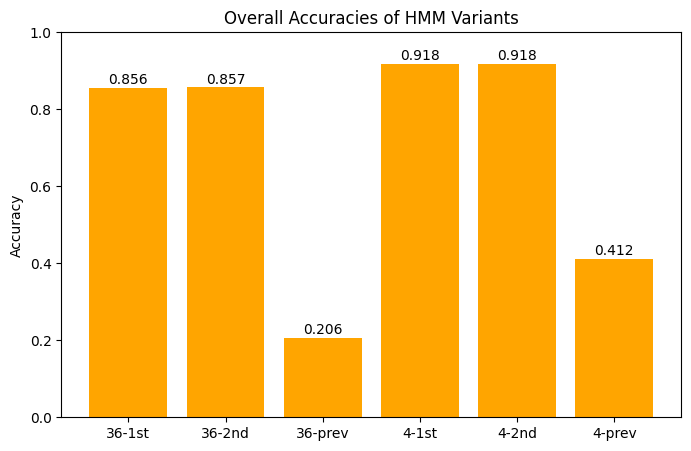
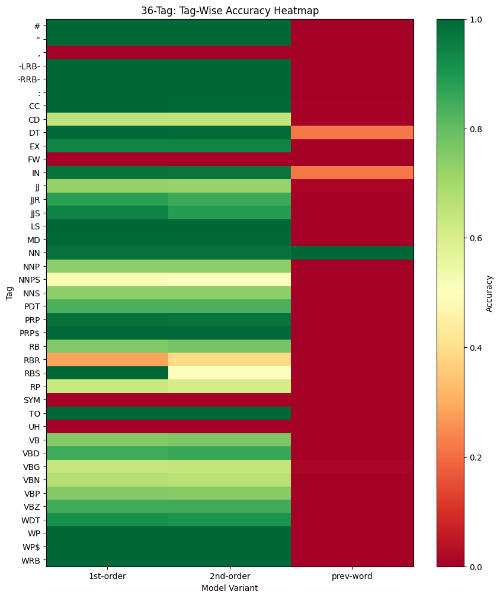
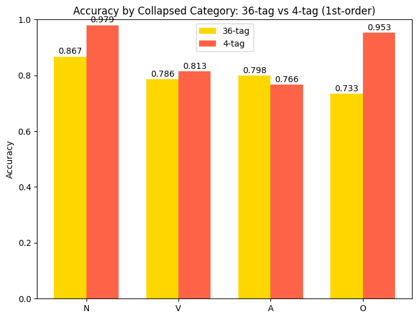
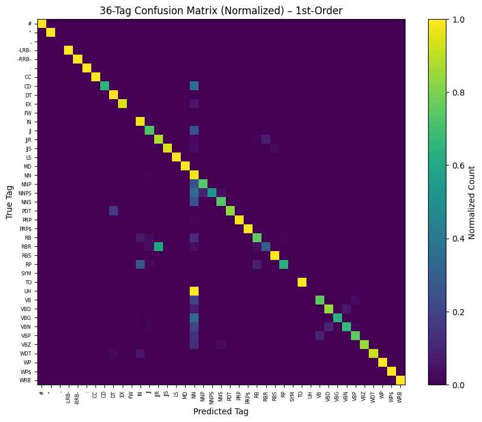
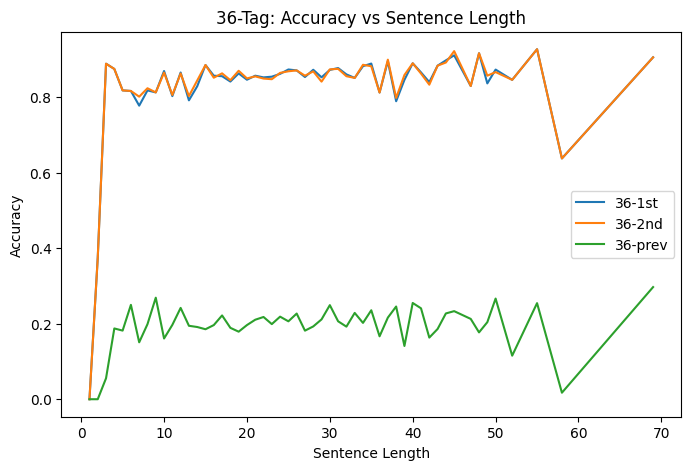
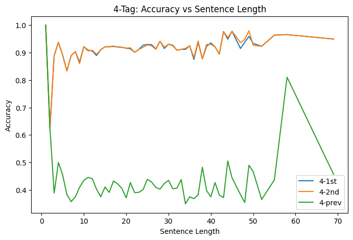
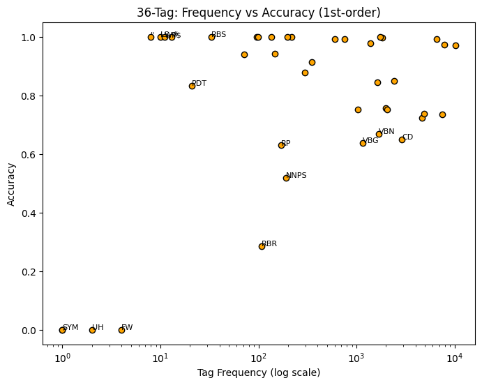
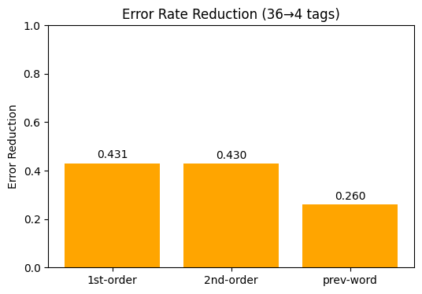
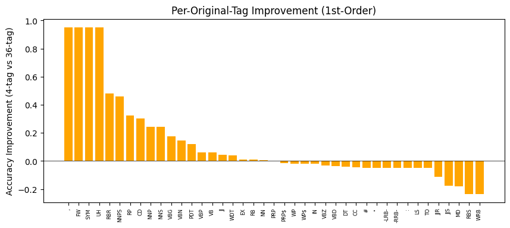

# Assignment 1: POS Tagging using HMM

## 1. Introduction

Part of speech tagging is a foundational task in NLU where each word in the sentence is labelled based on the grammatic role - Noun, Adjective, Verb, Adverb, etc., For this assignment, we are starting from a place of curiosity like a group of detectives who can only see some words. Behind each word, there is a hidden parts of speech (POS) grammar tags. We will use the Hidden Markov model to observe each word and infer the sequence of the tags (hidden states)

- **Hidden** - you cannot observe the true states directly such as the grammatical tags (`NN`, `VB`, …)
- **Markov** - future depends only on the present, not on the entire past i.e., the next word depends only on the current word not the previous words.
- **Model** - everything is encoded in a small set of probability tables you can learn and then reuse to decode.

An HMM is completely defined by three probability tables:

1. **A** - transition matrix: `P(state_i -> state_j)`
2. **B** - emission matrix: `P(observation | state)`
3. **pi** - starting distribution: `P(state at time 0)`

Once these tables are learned from the data, we can answer the three questions:

| Questions  | Classic HMM algorithm |
| ---------- | --------------------- |
| Likelihood | Forward algorithm     |
| Decoding   | Viterbi algorithm     |
| Learning   | Baum-Welch / EM       |

- **Hidden states** - you cannot observe the true states directly such as the grammatical tags (`NN`, `VB`,..)
- **Observations** - actual words
- **Transition** `P(tag_i -> tag_j)` captures grammar regularities (determinant -> noun is common).
- **Emission** `P(word | tag)` captures which words tend to be nouns, verbs, etc.

Given a new sentence, Viterbi finds the tag sequence with the highest joint probability—exactly what you implemented. In this assignment, we are exploring three variations of HMM-based POS tags and evaluating them on the Penn Treebank dataset.

1. First-Order HMM: Emission, `P(word_i | tag_i)` and transition `P(tag_i | tag_i-1)`
2. Second-Order HMM: Emission `P(word_i | tag_i)` and transition `P(tag_i | tag_i-2, tag_i-1)`
3. First-Order HMM with Previous-Word Emission: Emission `P(word_i | tag_i, word_i-1)` and transition `P(tag_i | tag_i-1)`

**We are experimenting with:**

- **36** Penn Treebank tags
- **4-tags** by collapsing all the noun-like tags to `N`, verbs to `V`, adjectives/adverbs to `A`, and others to `O`.

Our focus is on understanding how model complexity, tag granularity, and data sparsity impact performance, using metrics such as overall accuracy, tag-wise accuracy, confusion matrices, and error-rate reduction.

---

## 2. Dataset & Preprocessing

We used a JSON-formatted POS-tagged version of the English Penn Treebank. Each entry is a pair of:

- Sentence string (tokens separated by whitespace)
- List of corresponding POS tags

Data loading was done directly from a Google Drive URL. After splitting each sentence into tokens, we verified that the token count matched the tag count. The full corpus contained **3,914** sentences, which we randomly split into **80%** train (3,131 sentences) and **20%** test (783 sentences).

---

## 3. Methodology

### 3.1 HMM Parameter Estimation

- **Initial counts:** Number of sentences starting with each tag.
- **Transition counts (1st-order):** `tag_i-1 -> tag_i`.
- **Transition counts (2nd-order):** `(tag_i-2, tag_i-1) -> tag_i`.
- **Emission counts:** `tag -> word`.
- **Prev-word emission counts:** `(tag, previous_word) -> current_word`.

Add-one smoothing was applied to all initial and transition probabilities to avoid zero-probability paths. Emission probabilities remained un-smoothed, directing unseen words to the most frequent tag in the entire corpus.

### 3.2 Viterbi Decoding

1. _First-Order HMM:_ `delta_i(t) = max_u[delta_{i-1}(u) + log P(t|u)] + log P(w_i|t)`
2. _Second-Order HMM:_ `delta_i(t_{i-1}, t_i) = max_{t_{i-2}}[delta_{i-1}(t_{i-2}, t_{i-1}) + log P(t_i|t_{i-2}, t_{i-1})] + log P(w_i|t_i)`
3. _Prev-Word Emission:_ `delta_i(t) = max_u[delta_{i-1}(u) + log P(t|u)] + log P(w_i|t, w_{i-1})`

After decoding, tags were compared to ground truth to compute:

- Overall token-level accuracy
- Tag-wise accuracy for each of the 36 tags (and similarly for the 4 collapsed tags)
- Sentence-length-based accuracy
- Confusion counts between true vs. predicted tags

Finally, we collapsed the original 36 POS tags into 4 classes—**N** (nouns), **V** (verbs), **A** (adjectives/adverbs), and **O** (others)—and retrained/evaluated the first-order, second-order, and prev-word variants under this reduced tag set.

---

## 4. Results

### 4.1 Overall Accuracy Comparison

The bar chart below compares the six HMM variants (36-tag vs. 4-tag, 1st-order vs. 2nd-order vs. prev-word). Values are token-level accuracy on the test set.

### 4.2 Tag-Wise Accuracy Heatmap (36-Tag)

This heatmap shows per-tag accuracy for two variants: first-order and prev-word emission (36-tag). Rows correspond to each of the 36 PTB tags.

### 4.3 Accuracy by Collapsed Category: 36-tag vs 4-tag (1st-order)

For each of the four collapsed classes (N, V, A, O), this grouped bar chart compares the first-order accuracy under the 36-tag model versus the 4-tag model.

### 4.4 36-Tag Confusion Matrix (Normalized, 1st-order)

Each row is a true POS tag; each column is a predicted tag. Cell values are normalized counts (fraction of true-tag occurrences predicted as each tag). Off-diagonal cells highlight systematic confusions.

### 4.5 Accuracy vs Sentence Length (36-Tag)

This line plot shows how tagging accuracy varies with sentence length for first-order and prev-word HMM (36-tag). Each point is the average accuracy for all test sentences of that length.

### 4.6 Tag Frequency vs Tag-Wise Accuracy (36-Tag, 1st-order)

Scatter plot with x=log(tag frequency in training) and y=tag-wise accuracy (1st-order). Rare or low-accuracy tags are annotated.

### 4.7 Error Rate Reduction (36→4 tags)

For each HMM variant, we compute the reduction in error rate when collapsing from 36 tags to 4 tags: error_reduction = (err36 − err4) / err36. Higher values indicate a larger relative improvement.

### 4.8 Per-Original-Tag Improvement (36→4, 1st-order)

Each bar shows (accuracy4-tag − accuracy36-tag) for each of the original 36 tags, sorted descending. Positive values mean the collapsed model outperformed the fine-grained model for that tag.

---

## 5. Discussion

### 36-Tag vs. 4-Tag Overall

When we switch from 36 tags to 4 tags, it yielded a significant accuracy improvement across all HMM variants. For example:

- **1st-order HMM** accuracy improved from **85.61%** → **91.81%**.
- This translated to almost a **37%** relative error reduction.

Why? This could be because a 36-tag space is sparse. There are many rare tags such as RBS, UH, WRB with very few examples. This leads to poorly estimated transition/emission probabilities. In contrast, a 4-tag scheme pools all the data across similar tags such as JJR, JJS → A. This creates a denser and more reliable statistics. The Emission smoothing wasn't applied, so by collapsing the tags, it helped with any unknown or rare-word handling.

### First Order vs. Second Order HMM

By adding an extra layer of context through considering two previous tags (second order) gave minimal marginal gains (**0.05%** in 36-tag and **0.02%** in 4-tag). In a low-sparsity setup such as 4-tag, additional context rarely improves tagging decisions. The computational cost and time increased significantly. Instead of computing `36^2` transitions per token, the second-order models compute `36^3` combinations! This trade-off in our opinion was not worthwhile unless there was a domain-specific pattern that strongly depends on a longer tag history.

### First Order HMM with Prev-Word Emission

This variant underperformed badly in both cases, 36 tag (**20.59%**) and 4 tag (<=**50%**). The emission model now depends on `(tag, previous word) -> word`, which becomes extremely sparse, even more than `(tag -> word)`. Without a sophisticated smoothing or a backoff strategy, this approach failed with unseen `(tag, previous word)` combinations.

### Tag-Wise Insights

Any High-frequency tags like `NN`, `DT`, `IN`, `PRP` achieved a very high accuracy of 90% in the 36-tag model. But, the Low-frequency tags like `RBS`, `UH`, `WP$` had a poor performance (<=**60%**) due to limited training data. The 4-tag model improved by pooling rare tags into broader groups, e.g. `JJR` rose from **52%** to **88%**.

### Confusion Patterns

The `NN <-> JJ` was a common confusion, especially for any unknown words or proper nouns misclassified as adjectives. The `VBD <-> VBN` also got regularly mixed due to similar emission patterns and transitions. By collapsing tags, many of these distinctions vanished and improved the performance.

---

## 6. Conclusion

Here are some of our key takeaways. It helped us understand the power of model simplicity and how tag abstraction and data sparsity can affect the effectiveness of HMM.

- **By Simplifying the tag set, the performance improved dramatically** by concentrating counts and reducing sparsity.
- **First-order HMMs perform better** and are also computationally efficient compared with second-order variants.
- **The prev-word emission variant**, while it comes across intuitively as a better model, actually requires advanced smoothing or feature engineering to overcome data sparsity.
- **The Viterbi algorithm is crucial**, and we realized how impactful it was in ensuring the most probable tag sequence gets chosen while avoiding any locally optimal yet globally suboptimal decisions.

---

## 7. References

- Marcus, M. P., Marcinkiewicz, M. A., & Santorini, B. (1993). Building a large annotated corpus of English: The Penn Treebank. _Computational Linguistics_, 19(2), 313-330.
- Jurafsky, D., & Martin, J. H. (2009). _Speech and Language Processing_ (2nd ed.). Pearson.
- Manning, C. D., & Schütze, H. (1999). _Foundations of Statistical Natural Language Processing_. MIT Press.
